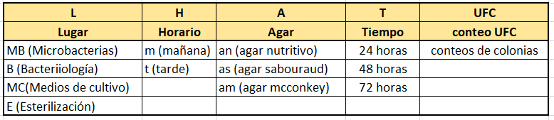

Estudio sobre crecimiento de bacterias en diferentes lugares de un la boratorios en la mañana, en la tarde, con diferentes horarios y diferentes agares.

			


```{r}
library(readxl)
library(tidyr)

b.0<-read_excel("../proj.bact/data/bact.xlsx",sheet = "d1",col_names = T)
b.1<-gather(b.0,            
               key  =  "agave",
               value = "ufc",
               -L)


# Información apilada de otra forma

b.2<-data.frame(read_excel("../proj.bact/data/bact.xlsx",sheet = "d2"),stringsAsFactors = T)
head(b.2)


```


```{r}

# Filtrado por Mañana (m)

mb.m<-b.2[b.2$H=="m" & b.2$UFC>0,-2]
head(mb.m)

mb.B<-mb.m[mb.m$L=="B",-1]
mb.E<-mb.m[mb.m$L=="E",-1]
mb.MB<-mb.m[mb.m$L=="MB",-1]
mb.MC<-mb.m[mb.m$L=="MC",-1]

(medias<-data.frame(B=c(mean(mb.B$UFC),median(mb.B$UFC)),
                    E=c(mean(mb.E$UFC),median(mb.E$UFC)),
                    MB=c(mean(mb.MB$UFC),median(mb.MB$UFC)),
                    MC=c(mean(mb.MC$UFC),median(mb.MC$UFC))))
                    


boxplot(UFC~L, data=mb.m)
boxplot(mb.E$UFC,mb.MB$UFC,mb.MC$UFC)

par(mfrow=c(2,2))
barplot(table(mb.B$UFC), main = "Bacteriología", ylab = "conteos", xlab="UFC", ylim = c(0,10))
barplot(table(mb.E$UFC),main = "Esterilización", ylab = "conteos", xlab="UFC",ylim = c(0,10))
barplot(table(mb.MB$UFC),main = "Mricrobacterias", ylab = "conteos", xlab="UFC",ylim = c(0,10))
barplot(table(mb.MC$UFC),main = "Medios de Cultivo",ylab = "conteos", xlab="UFC",ylim = c(0,8))


library(DescTools)
library(WRS2)
t1way(UFC~L, data=mb.m)
(phl<-lincon(UFC~L, data=mb.m))  #Prueba post-hoc


```


```{r}

# Filtrado por la tarde (t)

mb.t<-b.2[b.2$H=="t" & b.2$UFC>0,-2]
head(mb.t,8)

mb.B<-mb.t[mb.t$L=="B",-1]
mb.E<-mb.t[mb.t$L=="E",-1]
mb.MB<-mb.t[mb.t$L=="MB",-1]
mb.MC<-mb.t[mb.t$L=="MC",-1]

(medias<-data.frame(B=c(mean(mb.B$UFC),median(mb.B$UFC)),
                    E=c(mean(mb.E$UFC),median(mb.E$UFC)),
                    MB=c(mean(mb.MB$UFC),median(mb.MB$UFC)),
                    MC=c(mean(mb.MC$UFC),median(mb.MC$UFC))))
                    


boxplot(UFC~L, data=mb.t)


par(mfrow=c(2,2))
barplot(table(mb.B$UFC), main = "Bacteriología", ylab = "conteos", xlab="UFC", ylim = c(0,14))
barplot(table(mb.E$UFC),main = "Esterilización", ylab = "conteos", xlab="UFC",ylim = c(0,10))
barplot(table(mb.MB$UFC),main = "Mricrobacterias", ylab = "conteos", xlab="UFC",ylim = c(0,2))
barplot(table(mb.MC$UFC),main = "Medios de Cultivo",ylab = "conteos", xlab="UFC",ylim = c(0,11))

library(DescTools)
library(WRS2)
t1way(UFC~L, data=mb.t)


```


