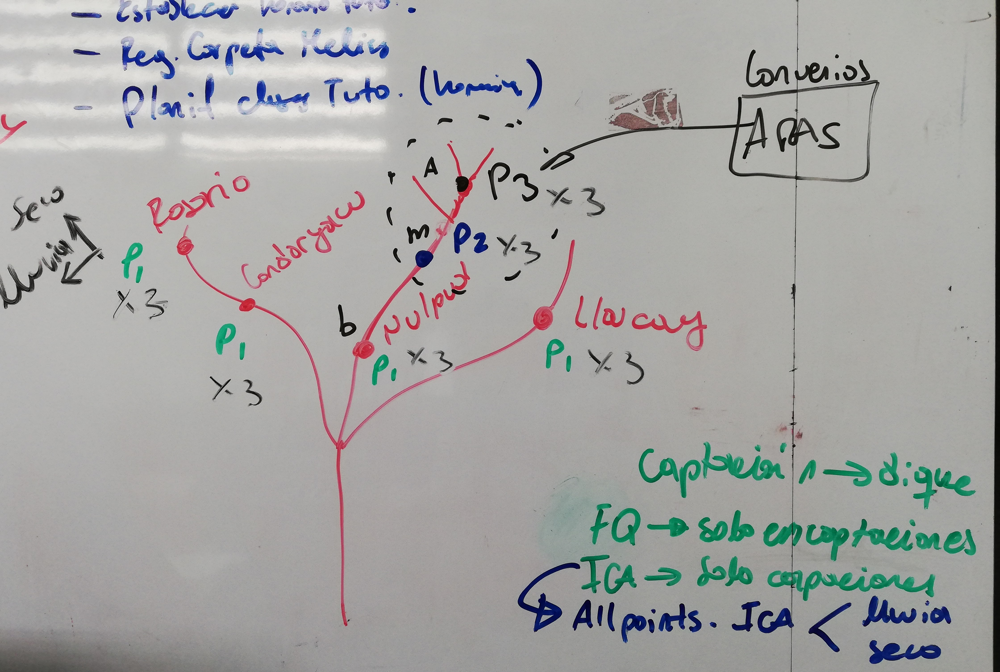

El set de datos se compone de un muestreo realizado como se ve en el siguiente gráfico:




```{r}

macroinv <- read_excel("macroinv.xlsx", sheet = "macro")
mi<-data.frame(quebrada=macroinv$quebrada,temp=macroinv$temp,lugar=macroinv$lugar,fecha=macroinv$fecha,orden=macroinv$orden,familia=macroinv$familia,conteo=macroinv$conteo,abi=macroinv$abi,bmw=macroinv$bmw,stringsAsFactors = T)
str(mi)
head(mi)

```

```{r}

#par(mfrow=c(2,2))

mi.nud<-data.frame(familia=mi$familia[mi$quebrada=="nudpud"],abi=mi$abi[mi$quebrada=="nudpud"])
t.nud.abi<-table(mi.nud$familia,mi.nud$abi)
barplot(t.nud.abi,horiz = T,main = "Nudpud",xlab = "Ocurrencias",ylab = "Indice ABI",cex.lab=0.9,xlim=c(0, 120),las=1,col=rainbow(length(t.nud.abi)))


mi.llau<-data.frame(familia=mi$familia[mi$quebrada=="llaucay"],abi=mi$abi[mi$quebrada=="llaucay"])
t.llau.abi<-table(mi.llau$familia,mi.llau$abi)
barplot(t.llau.abi,horiz = T,main = "Llaucay",xlab = "Ocurrencias",ylab = "Indice ABI",xlim=c(0, 65),las=1,col=rainbow(length(t.llau.abi)))


mi.cond<-data.frame(familia=mi$familia[mi$quebrada=="condoryacu"],abi=mi$abi[mi$quebrada=="condoryacu"])
t.cond.abi<-table(mi.cond$familia,mi.cond$abi)
barplot(t.cond.abi,horiz = T,main = "Condoryacu",xlab = "Ocurrencias",ylab = "Indice ABI",xlim=c(0, 65),las=1,col=rainbow(length(t.cond.abi)))


mi.rosa<-data.frame(familia=mi$familia[mi$quebrada=="rosario"],abi=mi$abi[mi$quebrada=="rosario"])
t.rosa.abi<-table(mi.rosa$familia,mi.rosa$abi)
barplot(t.rosa.abi,horiz = T,main = "Rosario",xlab = "Ocurrencias",ylab = "Indice ABI",xlim=c(0, 65),las=1,col=rainbow(length(t.rosa.abi)))


```

```{r}

#t.nud.abi
#t.llau.abi
#t.cond.abi
#t.rosa.abi

```


```{r}

# Todos los datos

mi.cut.abi<-cut(mi$abi,breaks = c(1,3,6,10),include.lowest = T)
levels(mi.cut.abi)<-c("resistente","tolerante","sensible")
(mi<-data.frame(mi,tipo.macro=mi.cut.abi))

t.mi.cut.abi.frec<-table(mi.cut.abi)
#cbind(t.mi.cut.abi.frec)

#par(mfrow=c(1,2))

mi.nud.cat<-data.frame(tipo.macro=mi$tipo.macro[mi$quebrada=="nudpud"],abi=mi$abi[mi$quebrada=="nudpud"])
tipo.macro.nud<-table(mi.nud.cat$tipo.macro)
barplot(tipo.macro.nud,horiz = T, main = "Nudpud", xlab = "Ocurrencias",ylab = "Calidad de macros",col = rainbow(length(tipo.macro.nud)))
tipo.macro.nud


mi.llau.cat<-data.frame(tipo.macro=mi$tipo.macro[mi$quebrada=="llaucay"],abi=mi$abi[mi$quebrada=="llaucay"])
tipo.macro.llau<-table(mi.llau.cat$tipo.macro)
barplot(tipo.macro.llau,horiz = T, main = "Llaucay", xlab = "Ocurrencias",ylab = "Calidad de macros",col = rainbow(length(tipo.macro.llau)))
tipo.macro.llau

#par(mfrow=c(1,2))

mi.cond.cat<-data.frame(tipo.macro=mi$tipo.macro[mi$quebrada=="condoryacu"],abi=mi$abi[mi$quebrada=="condoryacu"])
tipo.macro.cond<-table(mi.cond.cat$tipo.macro)
barplot(tipo.macro.cond,horiz = T, main = "Condoryacu", xlab = "Ocurrencias",ylab = "Calidad de macros",col = rainbow(length(tipo.macro.cond)))
tipo.macro.cond


mi.rosa.cat<-data.frame(tipo.macro=mi$tipo.macro[mi$quebrada=="rosario"],abi=mi$abi[mi$quebrada=="rosario"])
tipo.macro.rosa<-table(mi.rosa.cat$tipo.macro)
barplot(tipo.macro.rosa, horiz = T, main = "Rosario", xlab = "Ocurrencias",ylab = "Calidad de macros",col = rainbow(length(tipo.macro.rosa)))
tipo.macro.rosa

```


```{r}

# Tabla y diangrama de barras de especies del rango de (1 a 3) RESISTENTES  de nudpud

library(ggplot2)

mi.nud<-data.frame(familia=mi$familia[mi$quebrada=="nudpud"],abi=mi$abi[mi$quebrada=="nudpud"])
abi.r<-data.frame(f=mi.nud$familia[mi.nud$abi>=1],abi=mi.nud$abi[mi.nud$abi>=1])
abi.r<-data.frame(f=mi.nud$familia[mi.nud$abi<=3],abi=mi.nud$abi[mi.nud$abi<=3])
head(abi.r)
(t5<-table(abi.r$abi))
ggplot(abi.r,aes(f,fill=factor(abi), position='dodge',))+geom_bar()+coord_flip()+geom_text(y=0.7, stat="count", aes(label=paste(..count.., "obs.")))+ggtitle("Nudpud",subtitle = "Familias resitentes")+xlab("") + ylab("")+theme(plot.title = element_text(hjust = 0))+theme(legend.position="right")+ guides(fill=guide_legend(title="Valores ABI"))

# Diagrama de barras TOLERANTES
abi.t<-data.frame(f=mi.nud$familia[mi.nud$abi>=4],abi=mi.nud$abi[mi.nud$abi>=4])  # filtro >4
abi.t<-data.frame(f=abi.t$f[abi.t$abi<=6],abi=abi.t$abi[abi.t$abi<=6]) # filtro <6

ggplot(abi.t,aes(f,fill=factor(abi), position='dodge',))+geom_bar()+coord_flip()+geom_text(y=1, stat="count", aes(label=paste(..count.., "obs.")))+ggtitle("Nudpud",subtitle = "Familias tolerantes")+xlab("") + ylab("")+theme(plot.title = element_text(hjust = 0))+theme(legend.position="right")+ guides(fill=guide_legend(title="Valores ABI"))


# Diagrama de barras SENSIBLES
abi.t<-data.frame(f=mi.nud$familia[mi.nud$abi>=7],abi=mi.nud$abi[mi.nud$abi>=7])  # filtro >7
abi.t<-data.frame(f=abi.t$f[abi.t$abi<=10],abi=abi.t$abi[abi.t$abi<=10]) # filtro <10

ggplot(abi.t,aes(f,fill=factor(abi), position='dodge',))+geom_bar()+coord_flip()+geom_text(y=1, stat="count", aes(label=paste(..count.., "obs.")))+ggtitle("Nudpud",subtitle = "Familias sensibles")+xlab("") + ylab("")+theme(plot.title = element_text(hjust = 0))+theme(legend.position="right")+ guides(fill=guide_legend(title="Valores ABI"))


```


```{r}

# Llaucay

mi.llau<-data.frame(familia=mi$familia[mi$quebrada=="llaucay"],abi=mi$abi[mi$quebrada=="llaucay"])


# Diagrama de barras RESISTENTES
abi.t<-data.frame(f=mi.llau$familia[mi.llau$abi>=1],abi=mi.llau$abi[mi.llau$abi>=1])  # filtro >1
abi.t<-data.frame(f=abi.t$f[abi.t$abi<=3],abi=abi.t$abi[abi.t$abi<=3]) # filtro <3

ggplot(abi.t,aes(f,fill=factor(abi), position='dodge',))+geom_bar()+coord_flip()+geom_text(y=1, stat="count", aes(label=paste(..count.., "obs.")))+ggtitle("Llaucay",subtitle = "Familias resistentes")+xlab("") + ylab("")+theme(plot.title = element_text(hjust = 0))+theme(legend.position="right")+ guides(fill=guide_legend(title="Valores ABI"))


# Diagrama de barras TOLERANTES
abi.t<-data.frame(f=mi.llau$familia[mi.llau$abi>=4],abi=mi.llau$abi[mi.llau$abi>=4])  # filtro >4
abi.t<-data.frame(f=abi.t$f[abi.t$abi<=6],abi=abi.t$abi[abi.t$abi<=6]) # filtro <6

ggplot(abi.t,aes(f,fill=factor(abi), position='dodge',))+geom_bar()+coord_flip()+geom_text(y=1, stat="count", aes(label=paste(..count.., "obs.")))+ggtitle("Llaucay",subtitle = "Familias tolerantes")+xlab("") + ylab("")+theme(plot.title = element_text(hjust = 0))+theme(legend.position="right")+ guides(fill=guide_legend(title="Valores ABI"))


# Diagrama de barras SENSIBLES
abi.t<-data.frame(f=mi.llau$familia[mi.llau$abi>=7],abi=mi.llau$abi[mi.llau$abi>=7])  # filtro >7
abi.t<-data.frame(f=abi.t$f[abi.t$abi<=10],abi=abi.t$abi[abi.t$abi<=10]) # filtro <10

ggplot(abi.t,aes(f,fill=factor(abi), position='dodge',))+geom_bar()+coord_flip()+geom_text(y=1, stat="count", aes(label=paste(..count.., "obs.")))+ggtitle("Llaucay",subtitle = "Familias sensibles")+xlab("") + ylab("")+theme(plot.title = element_text(hjust = 0))+theme(legend.position="right")+ guides(fill=guide_legend(title="Valores ABI"))


```


```{r}

# Consoryacu

mi.cond<-data.frame(familia=mi$familia[mi$quebrada=="condoryacu"],abi=mi$abi[mi$quebrada=="condoryacu"])

# Diagrama de barras RESISTENTES
abi.t<-data.frame(f=mi.cond$familia[mi.cond$abi>=1],abi=mi.cond$abi[mi.cond$abi>=1])  # filtro >1
abi.t<-data.frame(f=abi.t$f[abi.t$abi<=3],abi=abi.t$abi[abi.t$abi<=3]) # filtro <3

ggplot(abi.t,aes(f,fill=factor(abi), position='dodge',))+geom_bar()+coord_flip()+geom_text(y=1, stat="count", aes(label=paste(..count.., "obs.")))+ggtitle("Condoryacu",subtitle = "Familias resistentes")+xlab("") + ylab("")+theme(plot.title = element_text(hjust = 0))+theme(legend.position="right")+ guides(fill=guide_legend(title="Valores ABI"))


# Diagrama de barras TOLERANTES
abi.t<-data.frame(f=mi.llau$familia[mi.llau$abi>=4],abi=mi.llau$abi[mi.llau$abi>=4])  # filtro >4
abi.t<-data.frame(f=abi.t$f[abi.t$abi<=6],abi=abi.t$abi[abi.t$abi<=6]) # filtro <6

ggplot(abi.t,aes(f,fill=factor(abi), position='dodge',))+geom_bar()+coord_flip()+geom_text(y=1, stat="count", aes(label=paste(..count.., "obs.")))+ggtitle("Condoryacu",subtitle = "Familias tolerantes")+xlab("") + ylab("")+theme(plot.title = element_text(hjust = 0))+theme(legend.position="right")+ guides(fill=guide_legend(title="Valores ABI"))


# Diagrama de barras SENSIBLES
abi.t<-data.frame(f=mi.llau$familia[mi.llau$abi>=7],abi=mi.llau$abi[mi.llau$abi>=7])  # filtro >7
abi.t<-data.frame(f=abi.t$f[abi.t$abi<=10],abi=abi.t$abi[abi.t$abi<=10]) # filtro <10

ggplot(abi.t,aes(f,fill=factor(abi), position='dodge',))+geom_bar()+coord_flip()+geom_text(y=1, stat="count", aes(label=paste(..count.., "obs.")))+ggtitle("Condoryacu",subtitle = "Familias sensibles")+xlab("") + ylab("")+theme(plot.title = element_text(hjust = 0))+theme(legend.position="right")+ guides(fill=guide_legend(title="Valores ABI"))


```


```{r}

# ROSARIO

mi.rosa<-data.frame(familia=mi$familia[mi$quebrada=="rosario"],abi=mi$abi[mi$quebrada=="rosario"])

# Diagrama de barras RESISTENTES
abi.t<-data.frame(f=mi.rosa$familia[mi.rosa$abi>=1],abi=mi.rosa$abi[mi.rosa$abi>=1])  # filtro >1
abi.t<-data.frame(f=abi.t$f[abi.t$abi<=3],abi=abi.t$abi[abi.t$abi<=3]) # filtro <3

ggplot(abi.t,aes(f,fill=factor(abi), position='dodge',))+geom_bar()+coord_flip()+geom_text(y=1, stat="count", aes(label=paste(..count.., "obs.")))+ggtitle("Rosario",subtitle = "Familias resistentes")+xlab("") + ylab("")+theme(plot.title = element_text(hjust = 0))+theme(legend.position="right")+ guides(fill=guide_legend(title="Valores ABI"))


# Diagrama de barras TOLERANTES
abi.t<-data.frame(f=mi.llau$familia[mi.llau$abi>=4],abi=mi.llau$abi[mi.llau$abi>=4])  # filtro >4
abi.t<-data.frame(f=abi.t$f[abi.t$abi<=6],abi=abi.t$abi[abi.t$abi<=6]) # filtro <6

ggplot(abi.t,aes(f,fill=factor(abi), position='dodge',))+geom_bar()+coord_flip()+geom_text(y=1, stat="count", aes(label=paste(..count.., "obs.")))+ggtitle("Rosario",subtitle = "Familias tolerantes")+xlab("") + ylab("")+theme(plot.title = element_text(hjust = 0))+theme(legend.position="right")+ guides(fill=guide_legend(title="Valores ABI"))


# Diagrama de barras SENSIBLES
abi.t<-data.frame(f=mi.llau$familia[mi.llau$abi>=7],abi=mi.llau$abi[mi.llau$abi>=7])  # filtro >7
abi.t<-data.frame(f=abi.t$f[abi.t$abi<=10],abi=abi.t$abi[abi.t$abi<=10]) # filtro <10

ggplot(abi.t,aes(f,fill=factor(abi), position='dodge',))+geom_bar()+coord_flip()+geom_text(y=1, stat="count", aes(label=paste(..count.., "obs.")))+ggtitle("Rosario",subtitle = "Familias sensibles")+xlab("") + ylab("")+theme(plot.title = element_text(hjust = 0))+theme(legend.position="right")+ guides(fill=guide_legend(title="Valores ABI"))


```


```{r}

fq <- read_excel("macroinv.xlsx", sheet = "fq")
head(fq)


```


